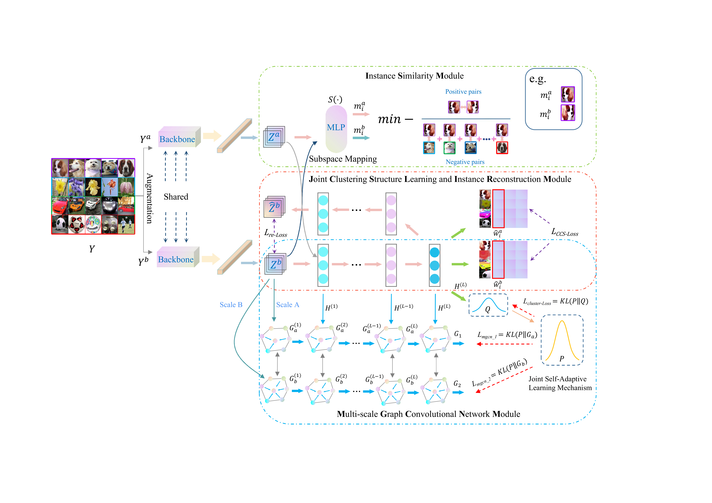

# Deep image clustering with contrastive learning and multi-scale graph convolutional networks (IcicleGCN)

This is the code for our Pattern Recognition'24 paper "Deep image clustering with contrastive learning and multi-scale graph convolutional networks"

# Dependency

- python>=3.7
- pytorch>=1.6.0
- torchvision>=0.8.1
- munkres>=1.1.4
- numpy>=1.19.2
- opencv-python>=4.4.0.46
- pyyaml>=5.3.1
- scikit-learn>=0.23.2
- cudatoolkit>=11.0

# Usage

## Configuration

There is a configuration file "config/config.yaml", where one can edit both the training and test options of the first stage.

In the file "icicleGCN.py", where one can edit training options of the second stage.

## Training

Take dataset ImageNet-10 as an example:

First stage:
After setting the configuration, to start first stage training, use the checkpoint_1000.tar to warm up the whole network, simply run
> python train.py

Second stage:
After setting the configuration, to start second stage training, use the checkpoint_1015.tar which was training in the first stage as the pretrain work for second stage train, simply run
> python icicleGCN.py

## Test

Once the first training is completed, there will be a saved model in the "model_path" specified in the configuration file "config.yaml". To test the trained model of first stage, run
> python cluster.py

Once the second training is completed, there will be a saved model in the "test_path" specified in the file "icicleGCN.py". To test the trained model of second stage, run
> python icicleGCN_test

and the final results will be save in file "icicleGCN_result" in TXT format

We uploaded the pretrained model which achieves the performance reported in the paper to the "save_IcicleGCN" folder for reference.

# Dataset

CIFAR-10, CIFAR-100, STL-10 will be automatically downloaded by Pytorch. Tiny-ImageNet can be downloaded from http://cs231n.stanford.edu/tiny-imagenet-200.zip. For ImageNet-10 and ImageNet-dogs, we provided their description in the "dataset" folder.

# Download
Anyone clicking on this link before December 09, 2023 will be taken directly to the final version of my article on ScienceDirect, which you are welcome to read or download.
> https://authors.elsevier.com/c/1hyKE77nKkYIC

# Citation
We are truly grateful for citing our paper! The BibTex entry of our paper is:

> @article{xu2023deep,
  title={Deep image clustering with contrastive learning and multi-scale graph convolutional networks},
  author={Xu, Yuankun and Huang, Dong and Wang, Chang-Dong and Lai, Jian-Huang},
  journal={Pattern Recognition},
  pages={110065},
  year={2024},
  publisher={Elsevier}
}
